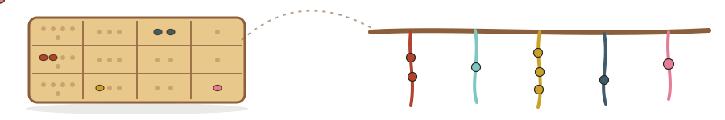
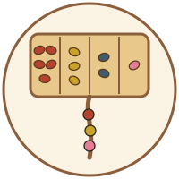

<p align="center">
  
</p>

<p align="center">
  
</p>

<h1 align="center">seeds</h1>

<p align="center">
  <em>🫘 Track agent work as facts in a knowledge graph, and pin any item to any moment</em>
</p>

<p align="center">
  <a href="LICENSE"></a>
  <a href="https://github.com/scbrown/seeds/actions/workflows/ci.yml"></a>
  <a href="https://github.com/scbrown/caboodle"></a>
</p>

**seeds is an issue tracker for AI coding agents that stores each work item as
facts in a [quipu](https://github.com/scbrown/quipu) knowledge graph instead of
rows in a versioned database. It is a CLI that answers the `bd`/`br` verbs
agents already type (`create`, `show`, `ready`, `close`, …) with `--json` in the
same shape. It is an experiment that tests one design question, fact-level
versus snapshot versioning, and not a competing beads implementation.** The
name comes from the counting board: a quipu keeper moved seeds across a
*yupana* to count, then knotted the result into the quipu.

## Why you would want it

- **Pin one item, not the whole database.** Every write is a quipu transaction,
  so `--at <tx>` resolves a single seed as it stood then, while the project
  keeps moving.
- **No commit step, no server to babysit.** The transaction id is the cursor;
  there is no dirty state, no garbage collection and no SQL server lifecycle.
- **Share a ledger like a package.** A project is one named graph, and a quipu
  qpack carries it, its shapes and its stored queries to another team.

The full case, and exactly what it is and is not:
[Introduction](docs/book/src/introduction.md).

## Install

v0 is a shell: there is no release yet, and the repository is private for
now, so you need read access. Build from source (needs Rust 1.85+):

```bash
cargo install --git https://github.com/scbrown/seeds --locked
```

Check it:

```bash
seeds --version
```

```text
seeds 0.0.1
```

If that prints an older version, another copy is earlier on your `PATH`:
`which -a seeds`.

## First success in three commands

```bash
seeds --version
seeds ready --json
echo "exit $?"
```

```text
seeds 0.0.1
seeds: ready not yet implemented (see docs/book)
exit 13
```

Every verb parses its flags and then refuses with its own exit code, so a
wrapper can tell which verb was asked for and record the demand.

## On your own code

| you want to… | run (once implemented) |
|---|---|
| see what is ready to work on | `seeds ready --json` |
| open a work item | `seeds create "title" -p 1 -t task` |
| claim it | `seeds update <id> --claim` |
| record that one blocks another | `seeds dep add <id> <depends-on>` |
| read an item as it was | `seeds show <id> --at <tx>` |

Every verb, flag and exit code: [Reference](docs/book/src/reference.md).

## Wire it into your agent

Agents keep typing `bd`. [desire-path](https://github.com/scbrown/desire-path)
rewrites that to seeds before the tool call runs:

```bash
dp alias --cmd bd --replace seeds
```

A `bd` verb seeds rejects is recorded, so `dp paths` becomes the seeds backlog.
Reads go to quipu SPARQL (`/query`) and writes to quipu knots (`/knot`); a
crew harness can use seeds as one more work-item tracker. How the pieces fit:
[Architecture](docs/book/src/architecture.md).

## Before you start

| | Linux x86_64 | macOS arm64 | macOS x86_64 | Linux arm64 |
|---|---|---|---|---|
| seeds | build | build | build | build |

Rust 1.85 or newer. A reachable quipu server once the verbs are implemented.

## What's next

- [The seeds book](docs/book/src/introduction.md): start here to go deeper
- [Docs map](docs/book/src/docs-map.md): every document in this repo, routed
- [The bd intent map](docs/book/src/intent-map.md): what seeds must provide, and what goes away

## 🧺 The stack

Caboodle installs these together and proves each one works; every tool also stands alone.

| tool | what it gives your agents |
|---|---|
| [caboodle](https://github.com/scbrown/caboodle) | one wizard that installs the stack and proves it works |
| [quipu](https://github.com/scbrown/quipu) | a knowledge graph that refuses facts that break its rules |
| [camayoc](https://github.com/scbrown/camayoc) | the starter vocabulary, and how new knowledge earns its way in |
| [bobbin](https://github.com/scbrown/bobbin) | search and context over your repositories, served over MCP |
| [yupana](https://github.com/scbrown/yupana) | which code calls which: the blast radius before an edit |
| [desire-path](https://github.com/scbrown/desire-path) | the tool calls your agents get wrong, so you can fix them |

seeds is an experiment built on top of these, not a member of the six:
quipu stores it, camayoc supplies its shapes and stored queries, caboodle
will install and verify it, and desire-path redirects `bd` to it.
[How seeds fits the stack](docs/book/src/stack.md).

## Contributing

```bash
just build
just test
just ci      # what CI runs
```

## 📜 License

[MIT](LICENSE)

<p align="center">
  
</p>
